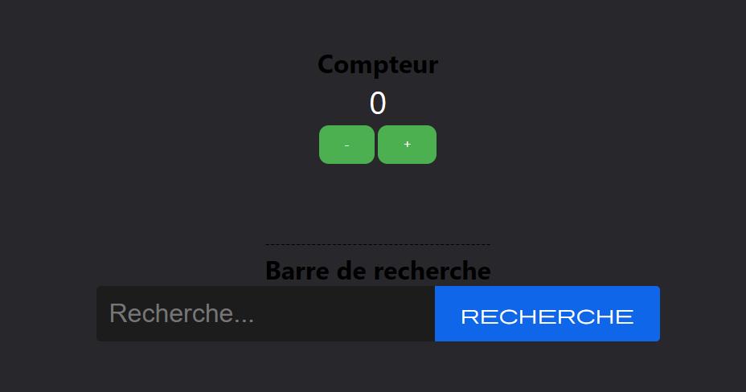

# 🌿 React Counter & Search App ✨

## 📝 Description
Cette application est un petit projet développé avec React dans le cadre de mon apprentissage.  
Elle permet de :
- Incrémenter ou décrémenter un **compteur**
- Effectuer une recherche à l’aide d’une **barre de recherche stylisée**

---

##  📸 Apercu

---

## ⚙️ Fonctionnalités

✅ Compteur avec boutons `+` et `-`  
✅ Style personnalisé (boutons, texte)  
✅ Barre de recherche avec champ de texte et bouton

---

## 🚀 Technologies utilisées

- React  
- HTML / JSX  
- CSS  
- Emmet

---

## 📦 Installation
- git clone https://github.com/codeurluce/compteur-rechercheApp_React
- cd compteur-rechercheApp_React
- npm install
- npm start
